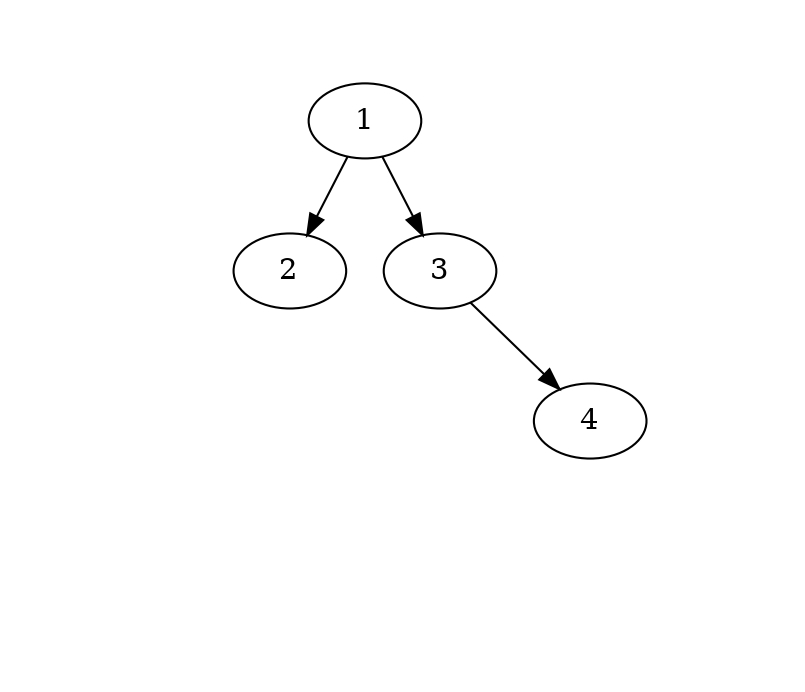
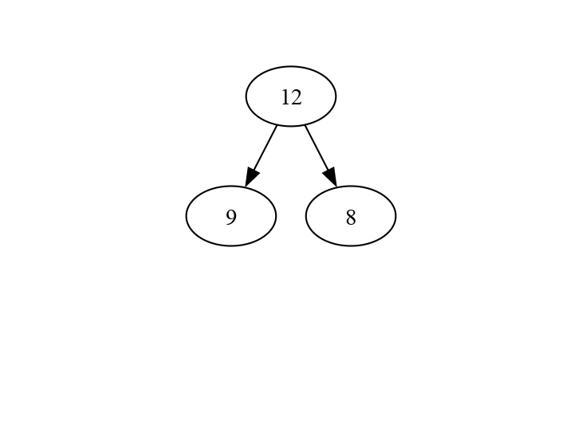
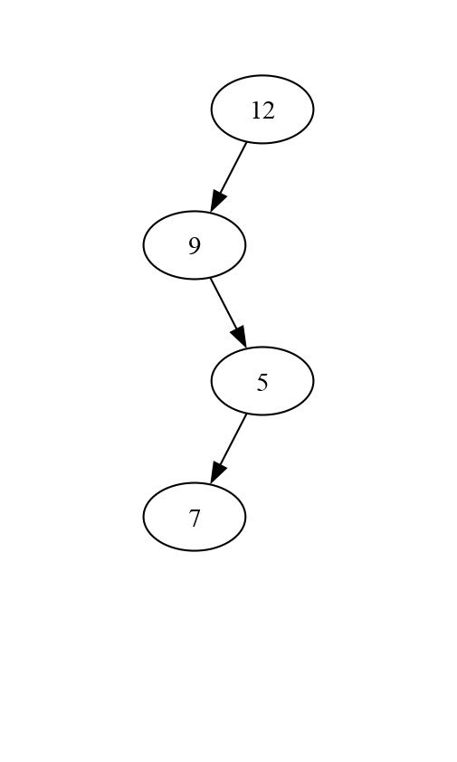
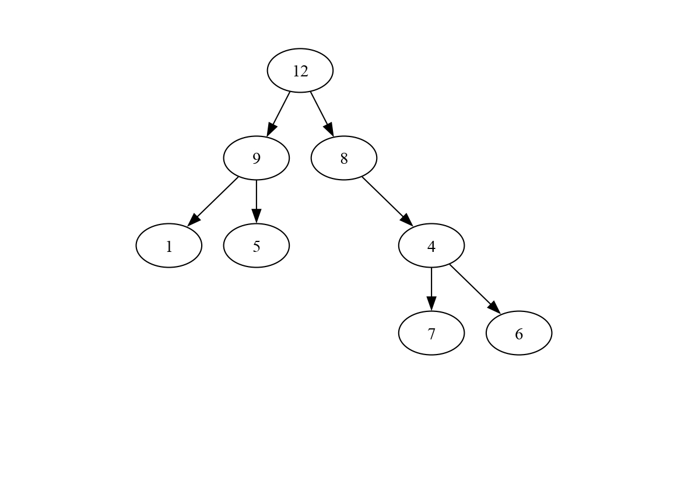
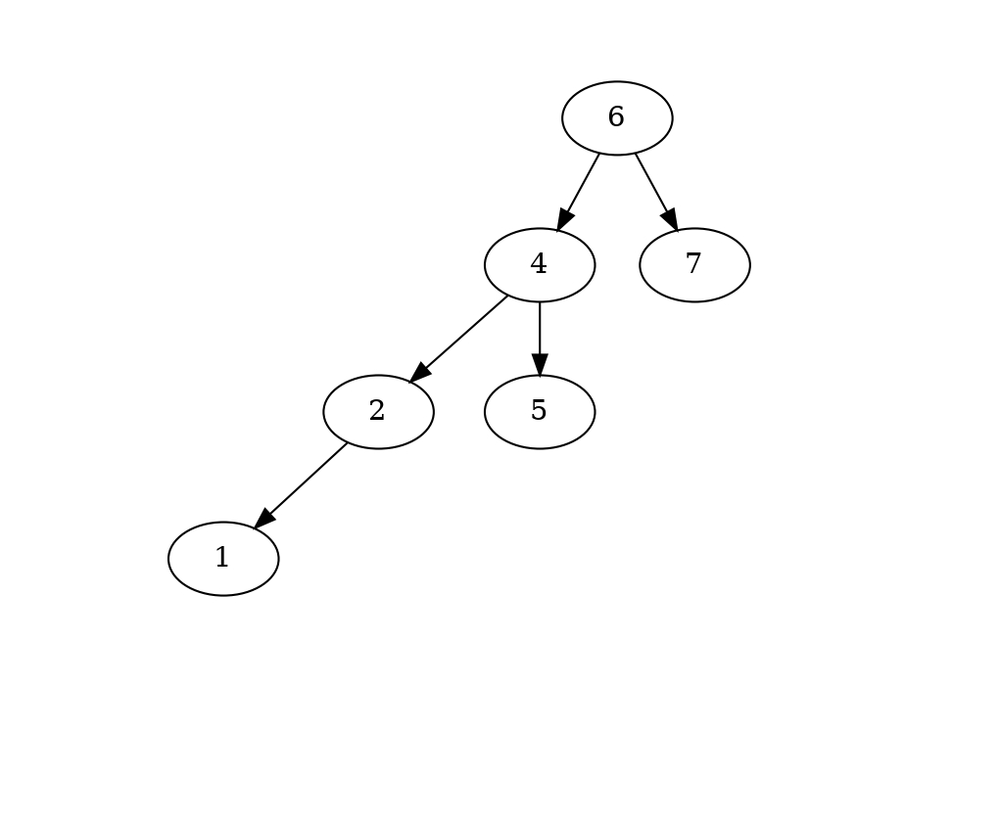
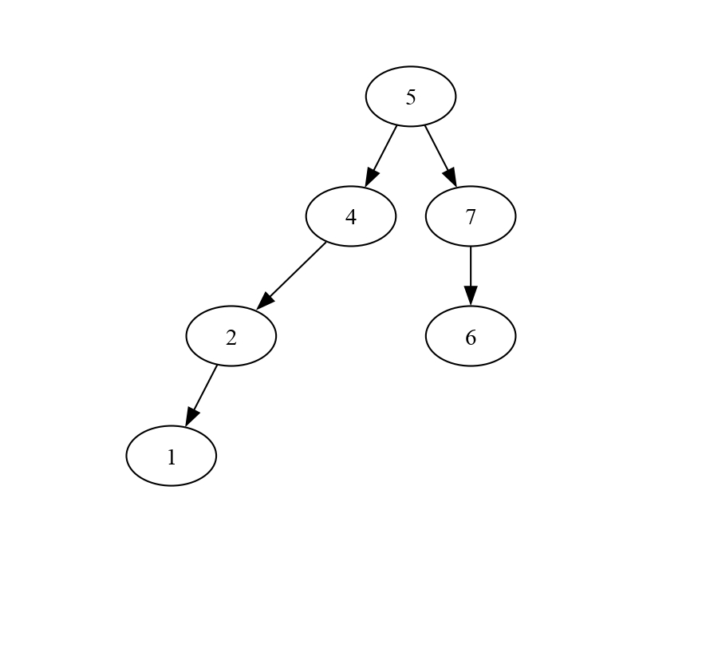
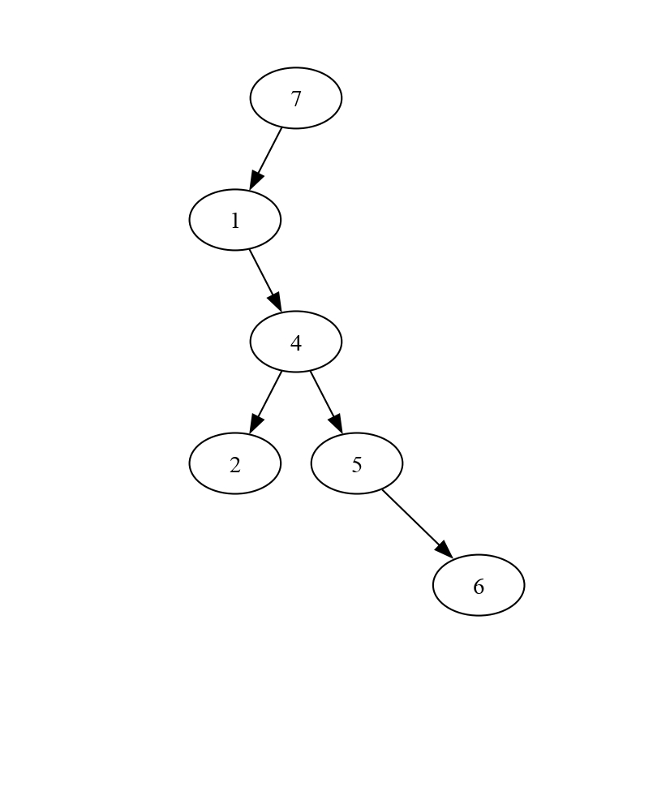

# Tp Arbres binaires


## État du TP

Décrivez ici l'état d'avancement du TP.

## Réponses aux questions

Indiquez ici les réponses aux questions posées dans le TP. Vous
reprendrez le numéro de la section et le numéro de la question. Par
exemple pour répondre à la question 3 de la section 2.4 vous indiquerez :

### Vérification des arbres produits
Après avoir compiler et executer le fichier `example1_tree.c` avec les commandes suivantes:
```bash
make example1_tree # Compile le programme
./example1_tree # Execute le programme (en créant un fichier example1.gv)
make example1.pdf # Produit example1.pdf si example1.gv existe et que le programme dot est installé
```
La visualisation de l'arbre est comme suit:



### Arbres binaires

#### Création d'arbres

##### Q1:

Après avoir implémenter les fonctions tree1`, `tree2` et `tree3` qui permettent de créer trois arbres différents:

En compilant avec la commande suivante:

```bash
make
```

Et éxecutant la commande suivante qui permet de creer les fichiers `.gv`:

```bash
./Test_tree
```
Et en éxecutant les commandes suivantes qui permettent de produit des fichiers `treeX.pdf` si `treeX.gv` existe et que le programme dot est installé:

```bash
make tree1.pdf
make tree2.pdf
make tree3.pdf
```
Après avoir suivie tout ce processus, j'ai réussi à obtenir le résultat suivant:







#### Impression

##### Q1:

Après avoir implémenter et tester la fonction `print_tree`, j'ai eu comme résultat:

```bash
9 12 8 
Size     = -1
Height    = -1
nbLeaves = -1
9 7 5 12 
Size     = -1
Height    = -1
nbLeaves = -1
1 9 5 12 8 7 4 6 
Size     = -1
Height    = -1
nbLeaves = -1
```
**NB: -1 est à cause su fait que la fonction `size`, `Height` et `nbLeaves` n'ont pas encore été implémenté**

#### Décomptes sur les arbres

##### Q1 / Q2 / Q3 :

Après avoir implémenter les trois fonction `nbLeaves`, `size`, `height` j'ai eu le résultat suivant pour les trois arbres construit précedement:

```bash
9 12 8 
Size     = 3
Height    = 1
nbLeaves = 2
9 7 5 12 
Size     = 4
Height    = 3
nbLeaves = 1
1 9 5 12 8 7 4 6 
Size     = 8
Height    = 3
nbLeaves = 4
```

##### Q5:

Après avoir implémenter et tester la fonction `nbTrees`, j'ai eu comme résultat:

```bash
Number of binary trees with 0 nodes is 1
Number of binary trees with 1 nodes is 1
Number of binary trees with 2 nodes is 2
Number of binary trees with 3 nodes is 5
Number of binary trees with 4 nodes is 14
Number of binary trees with 5 nodes is 42
Number of binary trees with 6 nodes is 132
Number of binary trees with 7 nodes is 429
Number of binary trees with 8 nodes is 1430
Number of binary trees with 9 nodes is 4862
Number of binary trees with 10 nodes is 16796
Number of binary trees with 11 nodes is 58786
Number of binary trees with 12 nodes is 208012
Number of binary trees with 13 nodes is 742900
Number of binary trees with 14 nodes is 2674440
Number of binary trees with 15 nodes is 9694845
Number of binary trees with 16 nodes is 35357670
Number of binary trees with 17 nodes is 129644790
Number of binary trees with 18 nodes is 477638700
Number of binary trees with 19 nodes is 1767263190
```
On constate lors du calcul des dernières valeurs que le programme prend plus de temps pour éxecuter ces dernières valeurs à cause du fait que le nombre d'arbres devient très grand pour les valeurs de noeud 18 et 19.

Pour bien analyse complexité d'éxecution, j'ai mis en place une fonctionnalité qui utilise la librairie `<time.h>`, et qui premet d'enregistrer le temps du **début** d'éxecution du calcule des valeurs de Cn ainsi que le temps de **fin** et fait une difference entre la **fin** et le **début** ce qui nous permet de mesurer la durée d'éxecution du programme.

```C
struct timespec debut, fin;
double temps_execution;

clock_gettime(CLOCK_MONOTONIC, &debut);
for (i = 0; i <= 19; i++) {
    printf("Number of binary trees with %d nodes is %d\n",i,(nbTrees(i)));
}
clock_gettime(CLOCK_MONOTONIC, &fin);
temps_execution = (fin.tv_sec - debut.tv_sec) + (fin.tv_nsec - debut.tv_nsec) / 1e9;
printf("Temps d'exécution : %.9f secondes\n", temps_execution);
```

Le résultat de cette mesure de temps est **`Temps d'exécution : 3.643728000 secondes`**.


##### Q7:

Après avoir implémenter cette deuxième versions plus efficace, je constate une grande difference en terme de complexité temporelle, ainsi que le résultat de cette mesure de temps est **`Temps d'exécution : 0.000058000 secondes`**, ce qui représente une très grosse difference entre les deux méthodes d'implémentation.

### Arbres binaires de recherche

##### Q1:

Après avoir défini l'arbre binaire de recherche à partir de l'algrithme d'insertion vu en cours, j'ai obtenu le resultat suivant:



##### Q3:

Pour s'assurer simplement que les arbres construits sont bien des **arbres binaires de recherche**, il faudra verifier que toutes les valeurs du sous-arbre gauche doivent être **inférieures ou égaleS** à la valeur du nœud et que toutes les valeurs du sous-arbre droit doivent être **strictement supérieures** à la valeur du nœud.

##### Q5:

Après avoir implémenter la fonction **add** qui ajoute une valeur à un arbre binaire de recherche ainsi que les fonctions **bst2** et **bst3** permettant la création des arbres binaires de recherche suivants en utilisant la fonction **add** dans lesquels les valeurs sont insérées successivement en suivant l'ordre donné :

- arbre 2 : 5, 4, 2, 7, 6, 1



- arbre 3 : 7, 1, 4, 5, 6, 2



##### Q7:

Pour les 3 arbres, la recherche de la valeur 0 , s'effectue en 6 comparaisons parce que 0 n'est present dans aucun des 3 arbres
donc ce qui fait qu'on est obligé de passer sur tout les noeuds de  l'arbre , vu que les 3 arbres sont de tailles 6 donc on effectue 6 compraisons.

##### Q8:

La valeur `minimal` de l'arbre binaire de recherche est **la premiere feuille à gauche**.

La valeur `maximal` de l'arbre binaire de recherche est **la premiere feuille à droite**.

### L'entier mystérieux

Après avoir implémenter la procédure de jeu `play`, qui permet de faire jouer l'ordinateur à l'entier mystérieux en utilisant un ABR avec une option d'intéraction avec le joueur via le terminale.

En compilant et éxecutant le programme avec les commandes suivantes.

```bash
make  # Compile le programme
./Test_tree # Execute le programme
```
J'ai obtenu comme résultat:

```bash
Mysterious tree between 12 and 24:
12 13 14 15 16 17 18 19 20 21 22 23 24 
choisir un nombre entre 12 et 24 ? :
20

 Est-ce 18 ? 

 Trop petit 

 Est-ce 21 
 
 Trop grand 

 Est-ce 19 
 
 Trop petit 

 Est-ce 20 
 
 C'est gagné !
```
