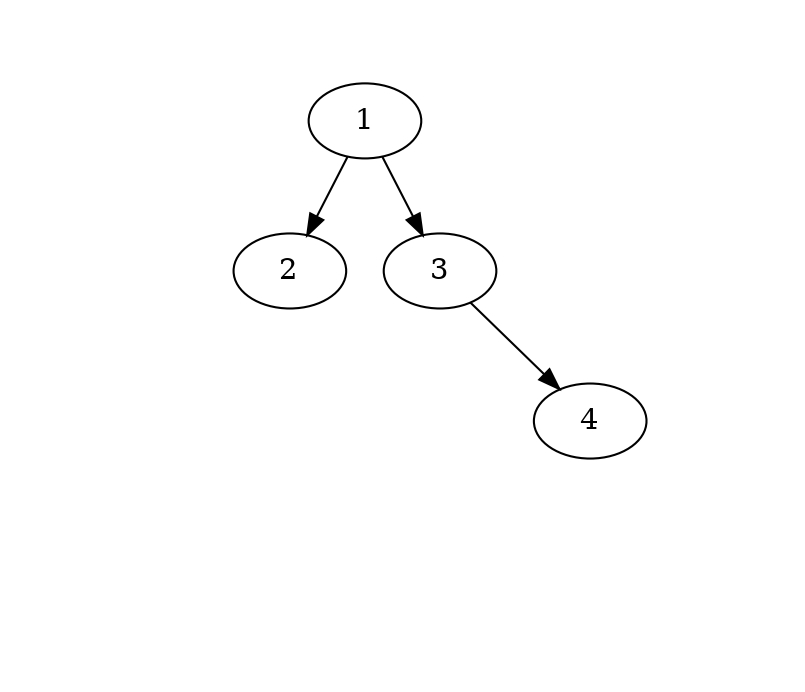

# Tp Arbres binaires


## État du TP

Décrivez ici l'état d'avancement du TP.

## Réponses aux questions

Indiquez ici les réponses aux questions posées dans le TP. Vous
reprendrez le numéro de la section et le numéro de la question. Par
exemple pour répondre à la question 3 de la section 2.4 vous indiquerez :

### Vérification des arbres produits
Après avoir compiler et executer le fichier `example1_tree.c` avec les commandes suivantes:
```bash
make example1_tree # Compile le programme
./example1_tree # Execute le programme (en créant un fichier example1.gv)
make example1.pdf # Produit example1.pdf si example1.gv existe et que le programme dot est installé
```
La visualisation de l'arbre est comme suit:


